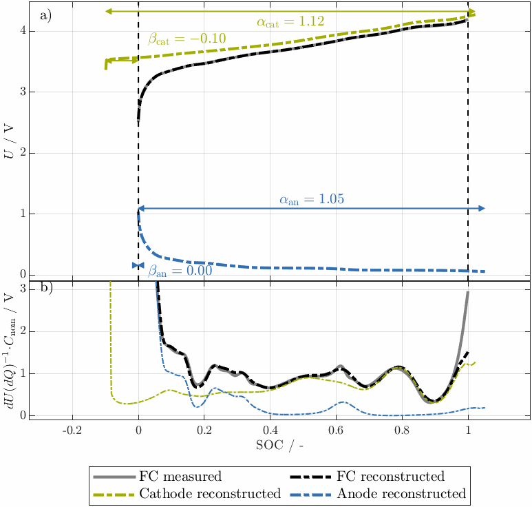

<div align="center"> <h1>DegradationModeAnalysis</h1>

Degradation mode analysis tool + tool to calculate silicon OCPs



</div> <h2>🔭 Overview</h2>
This tool allows the degradation mode analysis of lithium- and sodium-ion batteries. 
In case of a blend anode, the silicon OCP can be selected from a pool of literature OCPS.
We recommend, however, to calculate the silicon OCP based on a measured blend OCP, which can be
done by a second tool designed for this purpose. 

<br>

<!-- In your README -->
<div align="center"></div>


<h2>⚙️ Installation</h2> Clone the repository by running 


```bash
git clone git@github.com:tum-ees/degradation-mode-analysis.git
```

<h2>🎮 Usage</h2> Set the parameters and run the script in the MATLAB environment.

<h4>silicon OCP generation (optional)</h4>


Optional silicon OCP generation for Si–Gr blends:
You can generate a cell specific silicon OCP from a measured 
blend anode OCP and a graphite OCP using `generateSiCurve.m`. 
This follows the algebraic reconstruction 
<p><em>Q</em><sub>blend</sub> = <span style="font-style:italic;">&gamma;</span><sub>Si</sub>&middot;<em>Q</em><sub>Si</sub> + (1&minus;<span style="font-style:italic;">&gamma;</span><sub>Si</sub>)&middot;<em>Q</em><sub>Gr</sub></p>
and is robust even when <span style="font-style:italic;">γ</span><sub>Si</sub>
 is only roughly estimated. Filtering of the generated curve is available if you want a strictly monotonic OCP. Use this only if you have a Si–Gr blend and want to avoid mismatches from literature silicon OCPs.

<h4>degradation mode analysis</h4> Run the DMA by calling <code>[Data, s] = main_DMA(userSettingsOutside)</code>. Set all settings in <code>DMA_main</code>. For easier use you can overwrite any field from outside by passing a struct <code>s</code> into <code>main_DMA</code>; only provided fields change while defaults remain.


* Data handling: pOCV curves need to be stored either in one table or in different folders, set <code>s.inputIsAging_data_table</code> 
(1 for table mode using <code>s.tableFilter</code> and <code>s.nameTableColumnOCV</code>, 0 for folder mode with RPT1, RPT2 ... or analogous naming)

* Resampling: <code>s.dataLength</code> for resampling in SOC space. <code>s.smoothingPoints</code> for LOWESS smoothing of input curves.

* Cost function allows to use OCV, DVA and ICA in different regions; partial OCV as input implicitly possible with regions: set <code>s.weightOCV</code>, <code>s.weightDVA</code>, <code>s.weightICA</code>. Focus the fit with <code>s.ROI_OCV_min/max</code>, <code>s.ROI_DVA_min/max</code>, <code>s.ROI_ICA_min/max</code>.

* Solver and run control: choose <code>s.Algorithm</code> (e.g. <code>ga</code>, <code>particleswarm</code>, <code>patternsearch</code>, <code>GlobalSearch</code>, <code>fmincon</code>, <code>lsqnonlin</code>). 
For non-deterministic algorithms (such as <code>ga</code>) use <code>s.rmseThreshold</code>, <code>s.reqAccepted</code>, <code>s.maxTriesOverall</code>.

* Direction of pOCV: set <code>s.direction</code> to <code>'charge'</code> or <code>'discharge'</code>.

* Blend options: enable with <code>s.useBlend</code>; set <code>s.gammaBlend2_init</code> and <code>s.gammaBlend2_upperBound</code>.

* Inhomogeneity of anode and cathode estimated separately: toggle <code>s.allowAnodeInhomogeneity</code>, <code>s.allowCathodeInhomogeneity</code>; limit with <code>s.maxInhomogeneity</code>, <code>s.maxInhomogeneityDelta</code>.

* Constraints and order: bound changes with <code>s.maxGain</code>, <code>s.maxLoss</code>. Control fitting order via the sort of <code>s.nCUs</code> (ascending or descending).


<h2>💾 Content</h2>
Detailed documentation of the modules can be found below.
<br><br>

<details>

<summary> <h4> silicon OCP generation</h4> </summary> 

* folder calculateSiCurve: all necessary scripts to generate the silicon OCP

* <code>generateSiCurve.m</code>: script to perform the calcualation (GUI or script-based)

* subfolder 1_CalculateSiCurve_Helper: helper functions to run <code>generateSiCurve.m</code>

</details>


<details> <summary> <h4> degradation mode analysis </h4> </summary>

* <code>main_DMA.m</code>: main function. All settings are in this file

* <code>dma_core.m</code>: core routine that handles the main flow and all relevant steps

* folder HelperFunctions: required folder with helper functions

</details>

<details> <summary> <h4> input data </h4> </summary>

* folder InputData: literature OCPs and example data

* subfolders: <code>Graphite</code>, <code>Silicon</code>, <code>LFP</code>, <code>NCA</code>, <code>NMC</code>, <code>TestData</code>

These OCPs originate from published sources. Add proper citations if you use them. Check licenses and attribution requirements before redistribution

</details>

<h2>🎖️ Acknowledgments</h2>
We would like to thank Johannes Natterer for providing us with a data set of a cyclic aged P45B cell of his aging study for 
testing the tools.


<h2>📽️ Minimal workable example</h2>
In its current form, main_DMA serves as minimal workable example. 
In its current form, the script performs a blend electrode fitting for a cyclic aged Molicel P45B cell. 
The pOCV curves are stored using the table structure (<code>.\InputData\TestData\P45B_serial23_aging_data_table.mat </code>). 
The OCP curves for the MWE are described in the accompanied publication (see Citation).


<h2>📯 Developers</h2>

* [Mathias Rehm](mailto:mathias.rehm@tum.de), Chair of Electrical Energy Storage Technology, School of Engineering and Design, Technical University of Munich, 80333 Munich, 
Germany

* [Josef Eizenhammer](mailto:josef.eizenhammer@tum.de), Chair of Electrical Energy Storage Technology, School of Engineering and Design, Technical University of Munich, 80333 Munich, 
Germany
* Moritz Guenthner (student research project)
* Can Korkmaz (student research project)


<h2>✒️ Citation</h2>
This tool is published alongside with a open-source publication of Mathias Rehm in year 2026. In case you write any kind of publication, we kindly ask you to cite this publication. 
Please know, that an earlier version of this tool was used and validated to precisely determine the degradation modes for commerical sodium batteries by Mathias Rehm in another publication in 2026.
