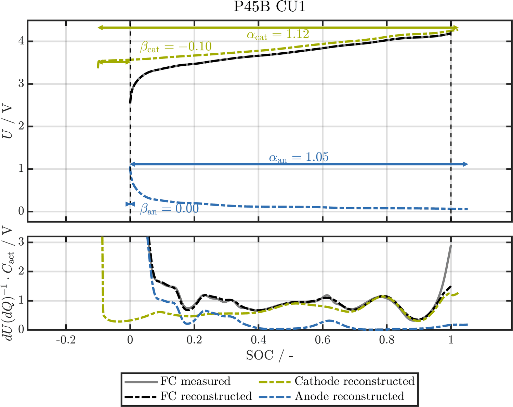

<div align="center">
  <h1>DegradationModeAnalysis</h1>

  Degradation mode analysis framework + tool to calculate silicon OCPs

  <br>

  <!-- environment and language -->
  <a href="https://www.mathworks.com/help/matlab/">
    
  </a>

  <!-- license badge: MIT -->
  <a href="https://opensource.org/licenses/MIT">
    
  </a>

  <!-- paper badges -->
  <a href="https://doi.org/10.1016/j.jpowsour.2026.239418">
    
  </a>

  <a href="https://doi.org/10.1039/D5EB00221D">
    
  </a>

  <!-- Zenodo DOI badge (concept DOI, resolves to latest version) -->
  <a href="https://doi.org/10.5281/zenodo.17591931">
    
  </a>

  <br>

  
</div>

<h2>🔭 Overview</h2>


This framework allows the degradation mode analysis of lithium- and sodium-ion batteries. 
In case of a blend anode, the silicon OCP can be selected from a pool of literature OCPS.
We recommend, however, to calculate the silicon OCP based on a measured blend OCP, which can be
done by a complementary tool designed for this purpose. 

<br>

<!-- In your README -->
<div align="center"></div>


<h2>⚙️ Installation</h2> Clone the repository by running 


```bash
git clone git@github.com:tum-ees/degradation-mode-analysis.git
```

<h2>🎮 Usage</h2> Set the parameters and run the script in the MATLAB environment.

<h4>silicon OCP generation (optional)</h4>


Optional silicon OCP generation for Si–Gr blends:
You can generate a cell specific silicon OCP from a measured 
blend anode OCP and a graphite OCP using `generateSiCurve.m`. 
This follows the algebraic reconstruction 
<p><em>Q</em><sub>blend</sub> = <span style="font-style:italic;">&gamma;</span><sub>Si</sub>&middot;<em>Q</em><sub>Si</sub> + (1&minus;<span style="font-style:italic;">&gamma;</span><sub>Si</sub>)&middot;<em>Q</em><sub>Gr</sub></p>
and is robust even when <span style="font-style:italic;">γ</span><sub>Si</sub>
 is only roughly estimated. Filtering of the generated curve is available if you want a strictly monotonic OCP. Use this only if you have a Si–Gr blend and want to avoid mismatches from literature silicon OCPs.

<h4>degradation mode analysis</h4> Run the DMA by calling <code>[Data, s] = main_DMA(userSettingsOutside)</code>. Set all settings in <code>main_DMA</code>. For easier use you can overwrite any field from outside by passing a struct <code>s</code> into <code>main_DMA</code>; only provided fields change while defaults remain.


* Data handling: all pOCV curves need to be stored in a table (see MWE as reference).

* Resampling: <code>s.dataLength</code> for resampling in SOC space. <code>s.smoothingPoints</code> for LOWESS smoothing of input curves.

* Cost function allows to use OCV, DVA and ICA in different regions; partial OCV as input implicitly possible with regions: set <code>s.weightOCV</code>, <code>s.weightDVA</code>, <code>s.weightICA</code>. Focus the fit with <code>s.ROI_OCV_min/max</code>, <code>s.ROI_DVA_min/max</code>, <code>s.ROI_ICA_min/max</code>.

* Solver and run control: choose <code>s.algorithm</code> (e.g. <code>ga</code>, <code>particleswarm</code>, <code>patternsearch</code>, <code>GlobalSearch</code>, <code>fmincon</code>, <code>lsqnonlin</code>). 
For non-deterministic algorithms (such as <code>ga</code>) use <code>s.rmseThreshold</code>, <code>s.reqAccepted</code>, <code>s.maxTriesOverall</code>.

* Direction of pOCV: set <code>s.direction</code> to <code>'charge'</code> or <code>'discharge'</code>.

* Anode blend option: enable with <code>s.useAnodeBlend</code> and set <code>s.gammaAnBlend2_init</code>, <code>s.gammaAnBlend2_upperBound</code>.

* Cathode blend option: enable with <code>s.useCathodeBlend</code> and set <code>s.gammaCaBlend2_init</code>, <code>s.gammaCaBlend2_upperBound</code>; supply a second cathode OCP.

* Inhomogeneity of anode and cathode estimated separately: toggle <code>s.allowAnodeInhomogeneity</code>, <code>s.allowCathodeInhomogeneity</code>; limit with <code>s.maxInhomogeneity</code>, <code>s.maxInhomogeneityDelta</code>. Use <code>s.inhomAnodeOffset</code> and <code>s.inhomCathodeOffset</code> to define the fraction of maximum inhomogeneity already present at SOC = 0 (<code>0</code> = classic behavior, <code>0.5</code> = 50% already present at SOC = 0).

* Constraints and order: bound changes with <code>s.maxCathodeGain</code>, <code>s.maxAnodeGain</code>, <code>s.maxAnBlend1Gain</code>, <code>s.maxAnBlend2Gain</code>, <code>s.maxCathodeLoss</code>, <code>s.maxAnodeLoss</code>, <code>s.maxAnBlend1Loss</code>, and <code>s.maxAnBlend2Loss</code>. Control fitting order via the sort of <code>s.nCUs</code> (ascending or descending).


<h2>💾 Content</h2>
Detailed documentation of the modules can be found below.
<br><br>

<details>

<summary> <h4> silicon OCP generation</h4> </summary> 

* folder calculateSiCurve: all necessary scripts to generate the silicon OCP

* <code>generateSiCurve.m</code>: script to perform the calcualation (GUI or script-based)

* subfolder 1_CalculateSiCurve_Helper: helper functions to run <code>generateSiCurve.m</code>

</details>


<details> <summary> <h4> degradation mode analysis </h4> </summary>

* <code>main_DMA.m</code>: main function. All settings are in this file

* <code>dma_core.m</code>: core routine that handles the main flow and all relevant steps

* folder HelperFunctions: required folder with helper functions

</details>

<details> <summary> <h4> input data </h4> </summary>

* folder InputData: literature OCPs and example data

* subfolders: <code>Graphite</code>, <code>Silicon</code>, <code>LFP</code>, <code>NCA</code>, <code>NMC</code>, <code>TestData</code>

These OCPs originate from published sources. Add proper citations if you use them. Check licenses and attribution requirements before redistribution

</details>

<h2>🎖️ Acknowledgments</h2>
We would like to thank Johannes Natterer for providing us with a data set of a cyclic aged P45B cell of his aging study for testing the framework. In addition, we thank Maximilian Leitenstern for support in migration to GitHub.


<h2>📽️ Minimal workable example</h2>
In its current form, main_DMA serves as minimal workable example. 
In its current form, the script performs a anode-blend electrode fitting for a cyclic aged Molicel P45B cell. 
The pOCV curves are stored using the table structure (<code>.\InputData\TestData\P45B_serial23_aging_data_table.mat </code>). 
The OCP curves for the MWE are described in the accompanied publication (see Citation).


<h2>📯 Developers</h2>

* [Mathias Rehm](mailto:mathias.rehm@tum.de), Chair of Electrical Energy Storage Technology, School of Engineering and Design, Technical University of Munich, 80333 Munich, 
Germany

* [Josef Eizenhammer](mailto:josef.eizenhammer@tum.de), Chair of Electrical Energy Storage Technology, School of Engineering and Design, Technical University of Munich, 80333 Munich, 
Germany
* Moritz Guenthner (student research project)
* Can Korkmaz (student research project)


<h2>✒️ Citation</h2>

This framework is published alongside an open-source paper where the full method and code are described.
If you use this repository in any publication, please cite:

> M. Rehm et al., "How to determine the degradation modes of lithium-ion batteries with silicon–graphite blend electrodes,"
> *Journal of Power Sources*, 2026, DOI: [10.1016/j.jpowsour.2026.239418](https://doi.org/10.1016/j.jpowsour.2026.239418)

The framework is also applied and validated on commercial sodium-ion batteries in the following publication.
We appreciate citing this work as well, and kindly ask you to do so if your work involves sodium-ion cells:

> M. Rehm et al., "Aging of commercial sodium-ion batteries with layered oxides: how to measure and analyze it?,"
> *EES Batteries*, 2026, DOI: [10.1039/D5EB00221D](https://doi.org/10.1039/D5EB00221D)

To cite a specific version of the code (e.g., for reproducibility), use the version-specific DOI from
[Zenodo](https://doi.org/10.5281/zenodo.17591931).
